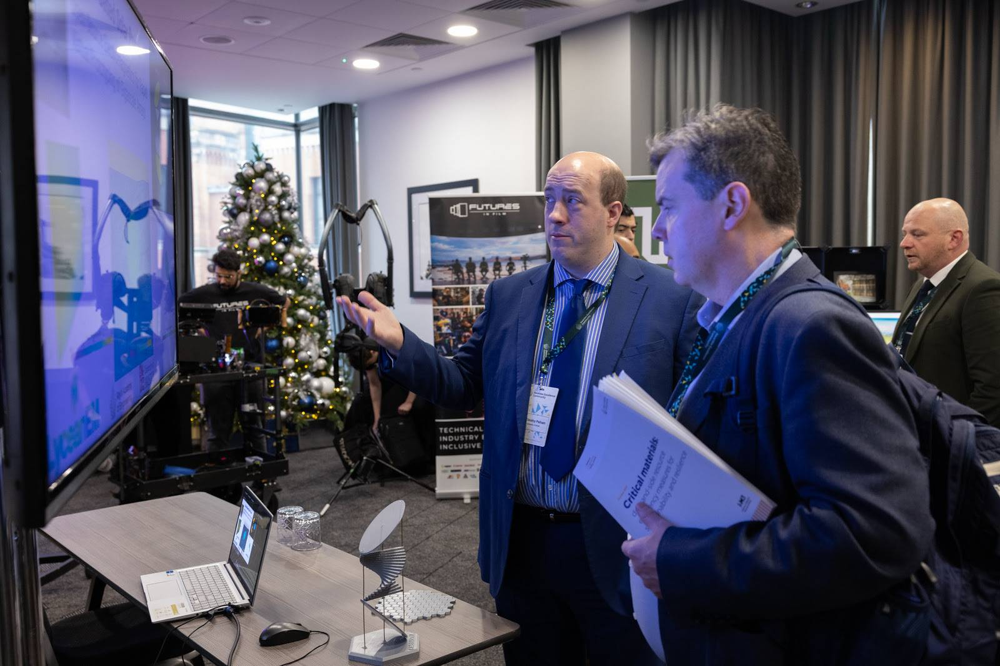
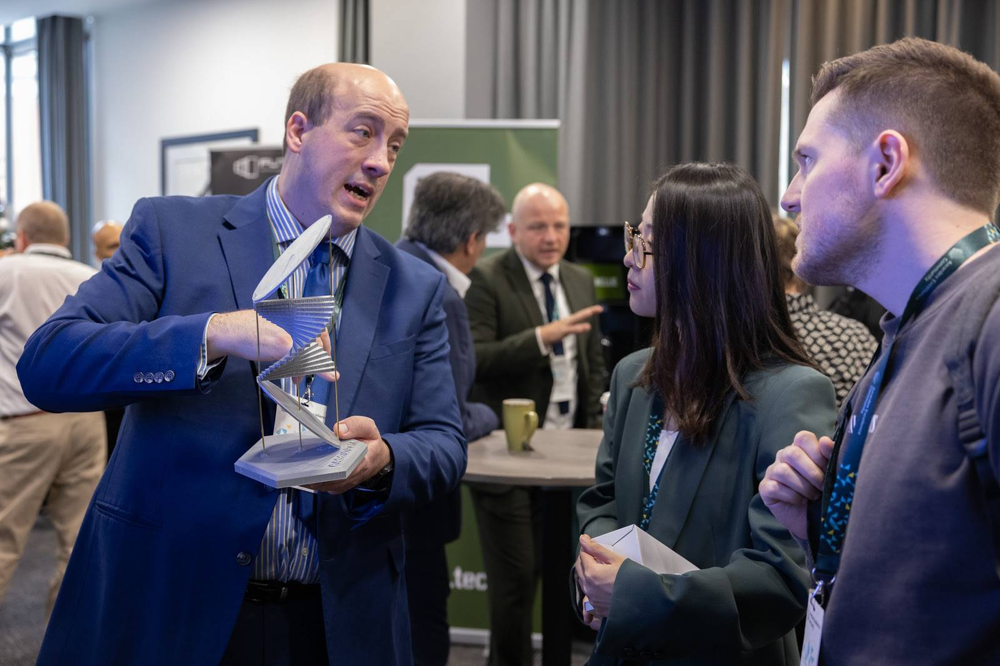
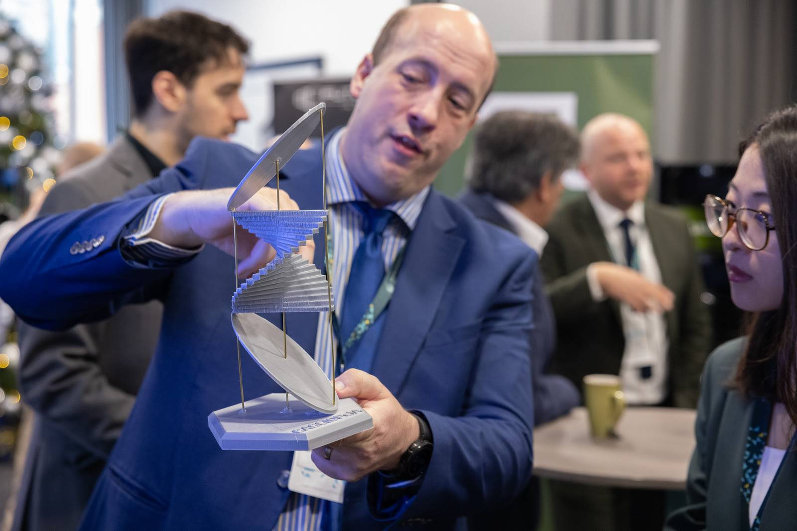
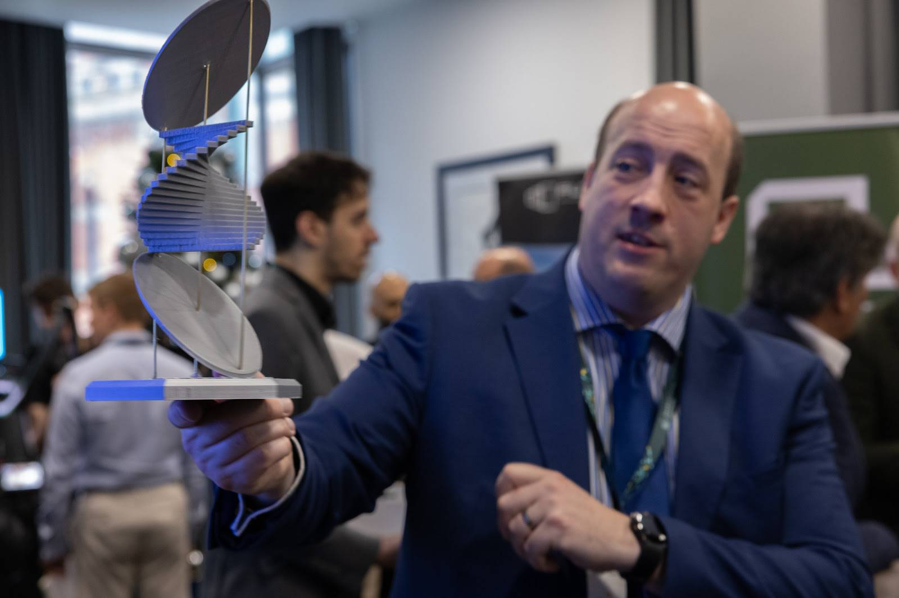
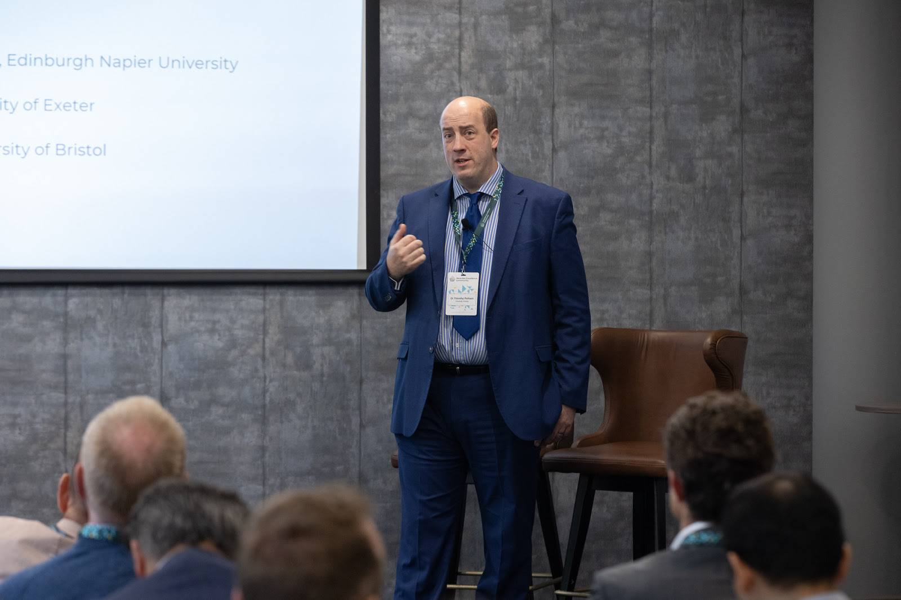
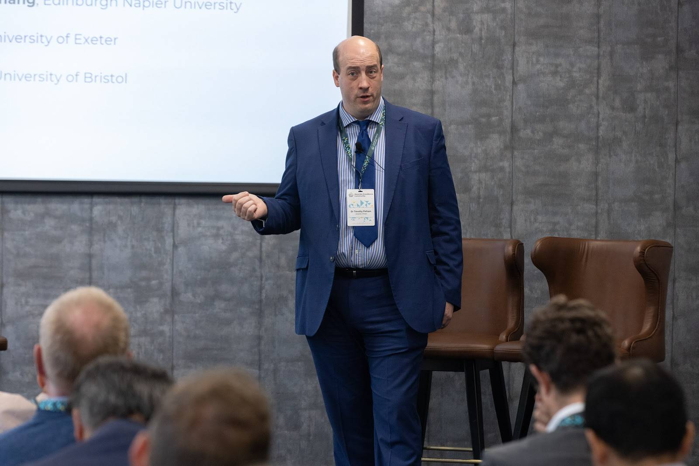

The [Royal Academy of Engineering Awardee Excellence Community Conference](https://raeng.org.uk/events/2024/nov/awardee-excellence-community-conference-2024) was an excellent opportunity to meet other awardees, and discuss the future of engineering in the UK. The conference was held in Manchester, and was a great opportunity to  brings together Royal Academy awardees and alumni to network, exchange ideas, learn from each other and to shape the work of the Academy.

---

Awardee Exhibition
------------------
The Awardee excellence conference offered the chance for me to talk with attendees one-to-one about my research. Of course no discussion of Space-based Solar Power would be complete without a model of the system, so I made two different exemplar models to use as props. A conventional antenna array, with hexagonal modular subarrays, inspired by the work of [Virtus Solis](https://virtussolis.space/), and the gossamer structure that is the CASSIOPeiA concept by [Ian Cash and International Electric](https://www.internationalelectric.com/), and Space Solar.

One of the highlights of the conference for me was the opportunity to talk about one of my favourite subjects, at least when it comes to the future of energy. Sadly the lightning talk was not recorded, but I did plan out the talk in advance.

Lightning Talk : Space-based Solar Power
---------------

Space Based Solar Power represents an ideal green energy source, minimal emissions to manufacture and install, then zero emissions during the operational phase. Space-based solar overcomes the challenges of intermittency which plague wind and terrestrial solar power, delivering reliable, scalable power 24/7. The development of Space-based Solar at scale requires a number of key enabling technologies, including orbital assembly, beamforming for wireless power transfer, and gigascale modelling for the design and operation of these kilometer scale structures. LyceanEM is an open source project to develop the electromagnetic modelling tools required to design and operate these systems. I developed the initial model as part of my Royal Academy of Engineering IC Fellowship, and we have scaled the model up from there with funding from the Department for Net Zero and Energy Security. There are significant computational improvements required to reach the desired scale, as the full scale concepts imply over a billion transmitting antennas, with over 10 billion receiving antennas on the ground for a 2GW system. These receiving arrays would be in the region of 11km by 7km in the UK, this sounds like a large system, and it is. However, by way of comparison the Thames Estuary Wind Farm has a maximum capacity of 630MW, and is twice this size, and has averaged only 252MW over the last year due to wind fluctuations. The Space-based solar array represents 2GW 24/7, all year round. Almost ten times the energy, in half the space. 

Space-based Solar has attracted significant interest in recent years due to the innovation of SpaceX, offering the potential of low cost access to space, and making Space-based solar power a cost-effective option for the future Zero Carbon Economy. The total energy consumption of the UK is 62GW, which is currently served with a mix of nuclear, gas, wind, and terrestrial solar power. As we move to a Zero Carbon model, we need cost-effective, reliable electricity which meets demand, without requiring massive grid batteries, or gas turbine backup.
LyceanEM is under continuous development to empower the companies working in this space, aiming to scale the computational efficiency as the need grows from the demonstrators currently planned, to 30MW systems hoped for deployment by 2030, and GW systems by 2040. 

Space-based Solar Power is a key technology for the future, and I am excited to be part of the journey to make it a reality. With the appropriate support from organisations like the UK Space Agency, the Department for Net Zero and Energy Security, and the Royal Academy of Engineering, I hope to be able to make a significant contribution to the UK's Zero Carbon future. Clean, reliable, affordable, and scalable energy for the future generations.

While I was happy to talk about Space-based Solar power, and my work on scalable modelling and my work on [LyceanEM](https://lyceanem.com/lyceanem/), what I found most rewarding was the opportunity to talk to other awardees and Royal Academy of Engineering Fellows about their work, and their views on the future of engineering in the UK. I often tell people that Space-based Solar to me is a `Thunderbirds` style project, that dynamic and hopeful vision of the future that with the right technology and support we can build a better world. I think that came across as one of the speakers at the conference told me that my talk made him feel like he was eight years old with wonder. I think that's a good sign. Of course the Thunderbirds even did an episode on solar power with a terrestrial generator and highly concentrated visible and infrared light, so maybe it's not so far-fetched after all. Of course, one of the benefits of Space-based Solar power is there is no need for high power densities, and so it should be inherently safe.

All the photos included here are courtesy of the Royal Academy of Engineering, and I am grateful for the opportunity to exhibit my work at the conference.

