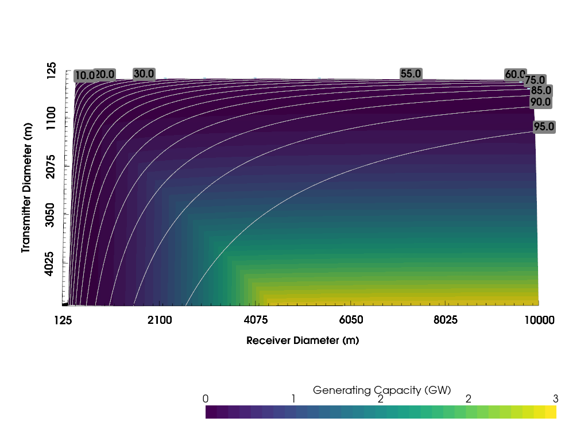
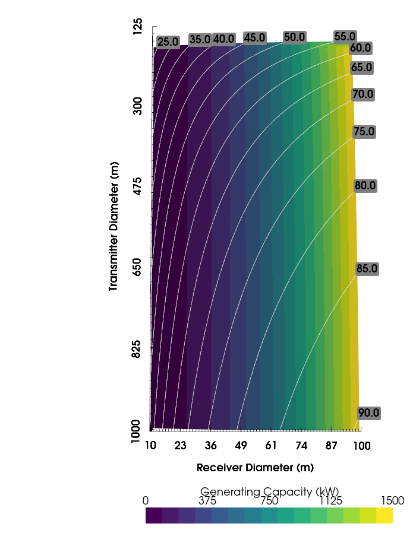
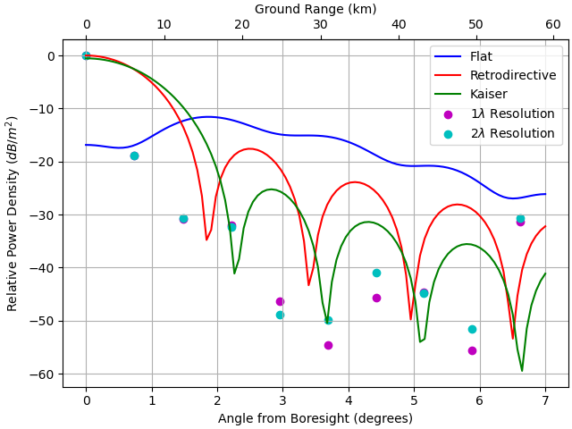
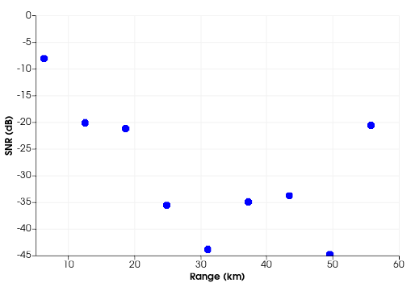

The emergence of Space-based Solar Power (SBSP) offers the potential of green, reliable, deliverable power from space to Earth. This technology is under development around the globe, with notable advances in the United Kingdom, Japan, China, and the United States. The UK has a strong position with the Space Energy Initiative which has been formed by stakeholders in government, academia and industry to develop SBSP. Advances in the UK have been funded by the Net Zero Innovation Portfolio, and various government agencies. However, beyond the primary application in civil energy production, the dynamic nature of wireless power beaming means that there is an attractive opportunity for military applications, including power beaming to forward operating bases, and the potential use of strong orbital signals to be used to support navigation and sensing systems. In particular, the well-defined positions and frequency standard of SBSP systems could allow their use as navigation beacons, and suitably designed passive radar receivers could use the satellites as convenient and durable illuminators of opportunity. A deployable power system which could produce over 1MW using a 10GHz narrow band power transmission from low earth orbit is considered, and the effects of transmitter size on efficiency and passive radar range is considered, while requiring less than 20% of the equivalent mass of a conventional deployable power generation system, without fuel requirements.

----------------------

Space-based Solar Power in Low Earth Orbit
-------------------------------------------------------------

## Introduction and Method
In order to examine the potential for space-based solar power an analytical approach was used to show the design constraints at X-band in terms of satellite transmitter size, receiver size, and orbit, based upon Goubau’s formula for maximum RF transfer efficiency [^1].

$$\eta=1-e^{-(\dfrac{\sqrt(A_{t}A_{r})}{\lambda D})^{2}}$$

A maximum power density figure of 240W/m2 is used to calculate maximum transmit power including atmospheric and conversion losses [^2].

Figure 1 : Generating Capacity for a Space-based Solar Power station in geosynchronous orbit based on transmitter and receiver diameter, with RF transfer efficiency contours.

This comparison is shown for both a large scale geosynchronous power station (Figure 1), and for a notional station in low earth orbit at an altitude of 480km (Figure 2). The Deployable Power Generation and Distribution System produces 800kW using JP-8 fuel [^3]. An equivalent space-based solar power system from Low Earth Orbit (480km) could generate 1MW with 10% of the installed weight, and no fuel requirements based on demonstrated rectenna array designs [^2]. This would require a rectanna array 75m across, just over half a football field, with a transmitter in orbit 375m in diameter. At X band this implies an antenna array with over 490 million antenna elements. LyceanEM was used to simulate the illuminated power for 10 sample points from the centre of the receiver to 56km away. Retrodirective beamforming was used to focus the power delivery beam [^4].

Figure 2 : Generating Capacity for a Space-based Solar Power station in low earth orbit based on transmitter and receiver diameter, with RF transfer efficiency contours.

## Results

The large array model results are shown in Figure 3 with a scaled model with a 1m2 transmitter at 6m range.

| Resolution | Elements (millions) | Time (minutes) |
|------------|---------------------|----------------|
| $2\lambda$ | 30.7                | 26             |
| $1\lambda$ | 122.8               | 103            |

Table 1 : Simulation size and runtime for LEO scale SBSP satellite, with diameter of 375m at X Band.

Figure 3 : Power Density for LEO SBSP Satellite (dots), and scaled comparison (lines).

The resultant power densities at the surface were used to calculate the potential SNR for a passive radar approach, without amplification based on a 24cm by 12cm antenna array, as shown in Figure 4 [^5].

$SNR = EIRP+G_{R}+\sigma_{b} - 20 \log_{10} (R_{T}R_{R}) -20 \log_{10}(\dfrac{4\pi f}{c}) - 10 \log_{10}(kT_{0}B)- F - L$

Passive Radar has been demonstrated at X-band with illumination power density of -82dBW/m2, -127dBW/m2 at L band [^5][^6].

## Conclusions

The initial modelling both demonstrates the parameter space for orbital power stations, and the potential power contours for such a system with planned RF transfer efficiencies on the order of 70%. While a LEO phased array of this size is not recommended due to the orbital period and lifespan implying large constellation requirements for persistent power to ground stations, it does demonstrate the modelling capability for antenna arrays far to large to simulate conventionally. The sizing and location of viable power satellites will represent a business and investment calculation, but the incurred sidelobes represent a potential challenge to other spectrum users, and an opportunity as sources of opportunity for navigation and sensing. If gold codes were implemented on the power beam, with a bandwidth similar to GNSS, satellite multi-lateration could be used to provide power, navigation, and sensing capabilities. While the sidelobe power can be reduced with larger transmitting array sizes, this is a comparatively expensive approach, and alternative beamforming schemes such as closed loop contouring approaches or even relatively simple Kaiser amplitude windowing can allow for an optimised beam with a consistent power density within the receiver, and reduced power density elsewhere.

[SBSPforPowerNavigationandSensing.pdf](../files/SBSPforPowerNavigationandSensing.pdf)

## References
[^1] Microwave Power Transmission from an Orbiting Solar Power Station, G. Goubau, Journal of Microwave Power, 1970

[^2] Deployable Power Generation and Distribution System (DPGDS), PD Power Systems, https://pdpowersystems.com/mobile-power-systems/

[^3] A Dual Polarization Microwave Power Transmission System for Microwave Propelled Airship Experiment, Y. Fujino, M. Fujita, N. Kaya, S. Kunimi, M. Ishii, N. Ogihara, N. Kusaka, S. Ida, Proceedings of ISAP 96, 1996, Japan

[^4] Microwave Power Transfer With Optimal Number of Rectenna Arrays for Midrange Applications, S. -T. Khang, D. -J. Lee, I. -J. Hwang, T. -D. Yeo and J. -W. Yu, IEEE Antennas and Wireless Propagation Letters, vol. 17, no. 1, pp. 155-159, Jan. 2018, doi: 10.1109/LAWP.2017.2778507

[^5] An Introduction to Passive Radar, H. D. Griffiths, C. J. Baker, ISBN-13 : 978-1-63081-036-8, 2017

[^6] Starlink-Based Passive Radar for Earth's Surface Imaging: First Experimental Results, P. Gomez-del-Hoyo and P. Samczynski, IEEE Journal of Selected Topics in Applied Earth Observations and Remote Sensing, vol. 17, pp. 13949-13965, 2024, 

